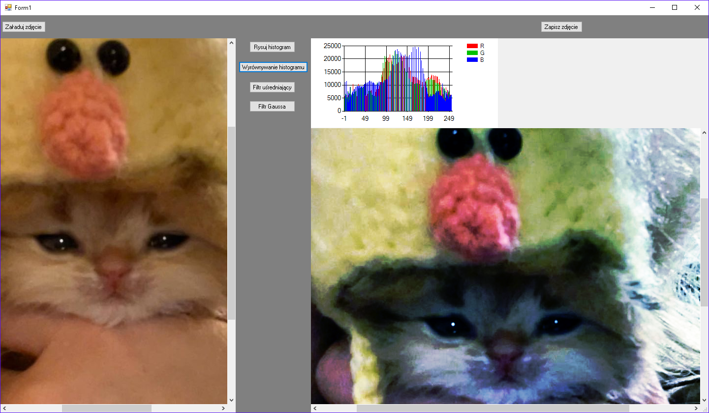

# Histogram_Blur
Program z GUI do modyfikacji obrazu za pomocą algorytmu wyrównującego histogram oraz filtru uśredniającego i filtru Gaussa.

<h2>Instalacja</h2>
<ol>
<li>pobrać w zipie</li>
<li>otworzyć plik .sln w visual studio</li>
</ol>
